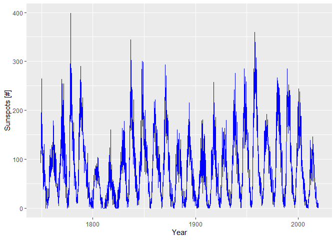
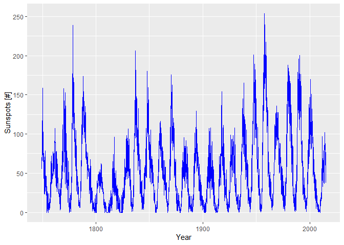

## Solar Spots

Download the data from http://sidc.oma.be


```sh

 [ -f ./download/snmtotcsv.csv ] && mv -f ./download/snmtotcsv.csv ./download/snmtotcsv.csv.bck
 wget -q -P download http://sidc.oma.be/silso/INFO/snmtotcsv.php
 sed -i '1s/^/year;month;time;sunspots;sd;no;final\n/' ./download/snmtotcsv.php
 mv ./download/snmtotcsv.php ./download/snmtotcsv.csv
```


```r
solar <- read.csv("./download/snmtotcsv.csv", sep=";")
solar$ts <- signif(solar$year + (solar$month-0.5)/12, digits=6)
solar$time <- paste(solar$year,solar$month, '15 00:00:00', sep='-')
solar <- solar[order(solar$ts),]

write.table(solar, file = "csv/monthly_sunspots.csv", append = FALSE, quote = TRUE, sep = ",",
            eol = "\n", na = "NA", dec = ".", row.names = FALSE,
            col.names = TRUE, qmethod = "escape", fileEncoding = "UTF-8")
```


## Plot Sunspots


```r
require("ggplot2")
```

```
## Loading required package: ggplot2
```

```
## Warning: package 'ggplot2' was built under R version 3.5.3
```

```r
solar <- read.csv("./csv/monthly_sunspots.csv", sep=",")
mp <- ggplot() +
      geom_line(aes(y=solar$sunspots, x=solar$ts), color="blue") +
      xlab("Year") + ylab("Sunspots [#]")
mp
```

<!-- -->

https://solarscience.msfc.nasa.gov/greenwch/spot_num.txt


```sh

# [ -f ./download/spot_num.csv ] && mv -f ./download/spot_num.csv ./download/spot_num.csv.bck
# wget -q -P download https://solarscience.msfc.nasa.gov/greenwch/spot_num.txt
# mv ./download/spot_num.txt ./download/spot_num.csv

```


```r
solar <- read.csv("./download/spot_num.csv", sep=",")
names(solar)[names(solar) == "YEAR"] <- "year"
names(solar)[names(solar) == "MON"] <- "month"
names(solar)[names(solar) == "SSN"] <- "sunspots"
names(solar)[names(solar) == "DEV"] <- "sd"
solar$ts <- signif(solar$year + (solar$month-0.5)/12, digits=6)
solar$time <- paste(solar$year,solar$month, '15 00:00:00', sep='-')
solar <- solar[order(solar$ts),]

write.table(solar, file = "csv/monthly_sunspots2.csv", append = FALSE, quote = TRUE, sep = ",",
            eol = "\n", na = "NA", dec = ".", row.names = FALSE,
            col.names = TRUE, qmethod = "escape", fileEncoding = "UTF-8")
```


```r
require("ggplot2")
solar <- read.csv("./csv/monthly_sunspots2.csv", sep=",")
mp <- ggplot() +
      geom_line(aes(y=solar$sunspots, x=solar$ts), color="blue") +
      xlab("Year") + ylab("Sunspots [#]")
mp
```

<!-- -->
